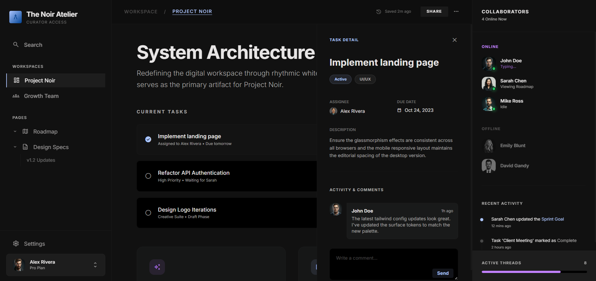
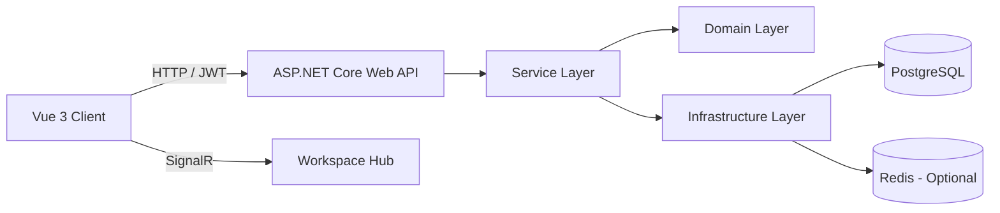

# Block Paged — Hệ thống Quản lý Tri thức Cá nhân theo Mô hình Block-based

> Một dự án full-stack được xây dựng theo hướng **clean architecture**, tập trung vào quản lý tri thức cá nhân, cộng tác thời gian thực và tối ưu năng suất làm việc.

---
## Demo



---

## Tổng quan dự án

**Block Paged** là một hệ thống web hỗ trợ người dùng quản lý tri thức cá nhân theo tư duy **block-based** — nơi nội dung được tổ chức theo các đơn vị nhỏ, linh hoạt, dễ mở rộng và dễ tái sử dụng.

Khác với mô hình ghi chú tuyến tính truyền thống, dự án hướng đến một không gian làm việc hiện đại, nơi người dùng có thể:

- tổ chức nội dung theo **workspace** và **page**
- quản lý công việc gắn với ngữ cảnh tài liệu
- theo dõi lịch sử thao tác
- nhận gợi ý công việc dựa trên hành vi sử dụng
- cộng tác theo thời gian thực với cơ chế **presence** và **block lock**

---

## Một số điểm nổi bật

### Về sản phẩm
- Thiết kế theo định hướng **Block-based Personal Knowledge Management**
- Kết hợp giữa **quản lý tri thức**, **quản lý công việc** và **cộng tác realtime**
- Có landing page, authentication flow và application layout rõ ràng
- Tập trung vào trải nghiệm hiện đại, UI chỉn chu, dễ phát triển thành sản phẩm SaaS

### Về kỹ thuật
- Frontend tách lớp API rõ ràng với **Vue 3 + Vite + TypeScript**
- Backend tổ chức theo mô hình **Domain / Infrastructure / Service / API**
- Sử dụng **ASP.NET Core Identity + JWT** cho xác thực và phân quyền
- Sử dụng **Entity Framework Core + PostgreSQL** cho persistence
- Tích hợp **SignalR** cho realtime
- Hỗ trợ **Redis backplane / cache / presence**, đồng thời có **fallback in-memory** để chạy local dễ dàng
- Có **Swagger UI** phục vụ test và mô tả API trong môi trường development

---

## Kiến trúc hệ thống



### Mô hình tổng thể

Hệ thống được thiết kế theo mô hình **client-server**:

- **Client** chịu trách nhiệm hiển thị giao diện, điều hướng, gọi API và xử lý trải nghiệm người dùng
- **Server** chịu trách nhiệm xử lý nghiệp vụ, xác thực, phân quyền, truy xuất dữ liệu và phát realtime event
- **Database** lưu trữ dữ liệu quan hệ
- **Redis** đóng vai trò cache, presence store và SignalR backplane khi được cấu hình

---

## Kiến trúc backend theo tầng

Backend được chia thành các project độc lập để tăng khả năng bảo trì và mở rộng:

### 1. `server.Domain`
Chứa **entity**, **enum**, **constant** và **contract** cốt lõi của hệ thống.

Vai trò:
- đại diện cho business model
- định nghĩa các interface như cache, realtime, presence
- tách biệt business core khỏi công nghệ triển khai

### 2. `server.Infrastructure`
Chứa toàn bộ phần tích hợp hạ tầng:

- EF Core persistence
- ASP.NET Identity
- JWT authentication
- CORS
- Swagger
- Redis cache
- SignalR hub
- Presence service
- Realtime notifier

### 3. `server.Service`
Chứa logic nghiệp vụ ứng dụng:

- authentication
- workspace
- page
- task
- comment
- activity log
- notification
- recommendation
- user preference
- performance metric

Đây là tầng xử lý chính giữa controller và database.

### 4. `server` (API)
Là Web API entry point:

- cấu hình middleware
- đăng ký dependency injection
- map controller
- map realtime hub
- khởi chạy ứng dụng

### 5. `service.Tests.Unit`
Là nơi dành cho unit test, thể hiện định hướng phát triển bài bản cho chất lượng phần mềm.

---

## Chức năng chính

## 1. Xác thực và người dùng
- đăng ký tài khoản
- đăng nhập
- phát hành JWT token
- tích hợp ASP.NET Core Identity
- hỗ trợ role-based access

## 2. Workspace Management
- tạo workspace
- cập nhật workspace
- xóa workspace
- lấy danh sách workspace theo user
- quản lý thành viên trong workspace

## 3. Page Management
- tạo page
- cập nhật page
- xóa page
- lấy page theo workspace
- hỗ trợ **sub-page**
- hỗ trợ tìm kiếm page theo từ khóa

## 4. Work Task Management
- tạo task trong workspace hoặc page
- cập nhật task
- xóa mềm task
- đánh dấu hoàn thành / mở lại
- lọc task theo workspace hoặc trạng thái
- phân công người thực hiện

## 5. Comment và Activity Log
- bình luận task
- hỗ trợ reply / restore comment
- lưu vết lịch sử hoạt động
- phục vụ audit, tracking và hiển thị recent logs

## 6. Notification
- lấy danh sách thông báo
- đếm unread
- đánh dấu đã đọc
- đánh dấu toàn bộ đã đọc

## 7. Realtime Collaboration
- heartbeat theo page
- lấy danh sách user đang active
- khóa block khi chỉnh sửa
- nhả khóa block
- broadcast event đến workspace thông qua SignalR

## 8. Recommendation & Productivity Intelligence
- ghi nhận lịch sử làm task
- lưu sở thích và khung giờ làm việc của user
- tính toán performance metric
- gợi ý task theo:
  - priority
  - due date
  - completion rate
  - last completed time
  - recommendation sensitivity

---

## Công nghệ sử dụng

### Frontend
- **Vue 3**
- **TypeScript**
- **Vite**
- **Vue Router**
- **Pinia**
- **Axios**
- **Bootstrap 5**
- **Bootstrap Icons**
- **js-cookie**

### Backend
- **.NET 8**
- **ASP.NET Core Web API**
- **ASP.NET Core Identity**
- **JWT Bearer Authentication**
- **Entity Framework Core**
- **Npgsql / PostgreSQL**
- **SignalR**
- **StackExchange.Redis**
- **Swashbuckle / Swagger**

### Hạ tầng
- **PostgreSQL**
- **Redis**
- **Docker Compose** cho Redis local

---

## Cấu trúc thư mục

```text
rudeusgs-block-based-pkm/
├── client/                     # Frontend Vue 3 + Vite
│   ├── src/
│   │   ├── api/                # API layer theo từng module
│   │   ├── components/         # UI components
│   │   ├── models/             # Type definitions / enums
│   │   ├── router/             # Routing
│   │   ├── stores/             # State management
│   │   └── views/              # Landing / Login / Register / App Layout
│   └── package.json
│
└── server/
    ├── server/                 # API host
    │   ├── Controllers/
    │   ├── Program.cs
    │   └── appsettings.*
    ├── server.Domain/          # Entity, enum, interface cốt lõi
    ├── server.Infrastructure/  # Persistence, auth, redis, signalr, swagger
    ├── server.Service/         # Business logic / services / models
    ├── redis/                  # Redis config + docker compose
    └── service.Tests.Unit/     # Unit tests
```

---

## Yêu cầu môi trường

### Bắt buộc
- **Node.js**: `^20.19.0` hoặc `>=22.12.0`
- **npm**
- **.NET SDK 8.0**
- **PostgreSQL**

### Khuyến nghị
- **Docker Desktop** để chạy Redis bằng Docker Compose
- **VS Code** hoặc **Visual Studio 2022**
- **Postman** hoặc sử dụng trực tiếp **Swagger UI**

---

## Hướng dẫn cài đặt

## 1. Clone source code

```bash
git clone https://github.com/RudeusGs/block-based-pkm.git
cd rudeusgs-block-based-pkm
```

---

## 2. Cài đặt frontend

```bash
cd client
npm install
```

Chạy frontend ở môi trường development:

```bash
npm run dev
```

Mặc định frontend sử dụng `Vite`.

---

## 3. Cài đặt backend

Di chuyển đến project server API:

```bash
cd ../server/server
```

Khôi phục package:

```bash
dotnet restore
```

---

## 4. Cấu hình database PostgreSQL

Tạo database PostgreSQL, ví dụ:

```sql
CREATE DATABASE block_paged_db;
```

Sau đó cấu hình connection string trong file `appsettings.json` hoặc thông qua environment variable.

---

## 5. Cấu hình Redis

Từ thư mục `server/`, chạy:

```bash
docker compose -f redis/docker-compose.redis.yml up -d
```

Kiểm tra log:

```bash
docker compose -f redis/docker-compose.redis.yml logs -f
```

Nếu chưa cấu hình Redis, hệ thống vẫn có thể chạy với:
- `InMemoryCacheService`
- `InMemoryPresenceService`

---

## 6. Tạo migration và cập nhật database

Nếu bạn muốn tạo migration mới:

```bash
dotnet ef migrations add InitDatabase --project ../server.Infrastructure --startup-project .
```

---

## 7. Chạy backend

Từ thư mục `server/server`:

```bash
dotnet run
```

Frontend hiện đang gọi API mặc định tới:

```text
https://localhost:7135/api/
```

Vì vậy hãy đảm bảo backend chạy profile HTTPS hoặc sửa lại `baseURL` trong `client/src/api/base.api.ts` nếu cần.

---

## Cấu hình ứng dụng

```text
server/server/appsettings.json
```

Nội dung mẫu:

```json
{
  "ConnectionStrings": {
    "Connection": "Host=localhost;Port=5432;Database=block_paged_db;Username=postgres;Password=your_password"
  },
  "JWT": {
    "Secret": "your-super-secret-key-with-enough-length",
    "ValidIssuer": "BlockPaged",
    "ValidAudience": "BlockPagedUsers"
  },
  "Cors": {
    "AllowedOrigins": [
      "http://localhost:5173",
      "https://localhost:5173"
    ]
  },
  "Redis": {
    "Connection": "localhost:6379"
  }
}
```
---

## Chạy dự án ở môi trường local

### Terminal 1 — Backend
```bash
cd server/server
dotnet run
```

### Terminal 2 — Frontend
```bash
cd client
npm run dev
```

Sau đó truy cập frontend tại URL do Vite cung cấp, thường là:

```text
http://localhost:5173
```

---

## API và Realtime

## API base URL
```text
https://localhost:7135/api/
```

## Swagger UI
Trong môi trường development, Swagger UI được cấu hình ở **root path**.  
Nghĩa là sau khi chạy backend, bạn có thể truy cập trực tiếp:

```text
https://localhost:7135/
```

## Realtime Hub
```text
/hubs/workspace
```
# Báo cáo Load Testing - Hệ thống Collaborative

## Công nghệ sử dụng
- ASP.NET Core Web API
- PostgreSQL
- Redis (Realtime Presence & Lock)
- k6 (Load Testing)

---

## Kịch bản kiểm thử

### 1. Hiệu năng đọc (Workspace API)
- Endpoint: `GET /api/workspaces/my`
- Số user: ~80 concurrent

**Kết quả:**
- Trung bình (avg): ~66ms
- P95: ~180ms
- Tỉ lệ lỗi: 0%

---

### 2. Hiệu năng realtime (Presence & Lock - Redis)
- Endpoint:
  - `POST /api/presence/heartbeat/{pageId}`
  - `GET /api/presence/active-users/{pageId}`
- Số user: ~80 concurrent

**Kết quả:**
- Trung bình (avg): ~4ms
- P95: ~11ms
- Tỉ lệ lỗi: 0%

---

### 3. Hiệu năng ghi (WorkTask API)
- Endpoint:
  - `PUT /api/work-tasks/{id}`
  - `POST /complete`
  - `POST /reopen`
- Số user: ~60 concurrent

**Kết quả:**
- Trung bình (avg): ~200–250ms
- P95: ~400–500ms
- Tỉ lệ lỗi: có conflict (do nhiều user cập nhật cùng lúc)

---

## Hạn chế hiện tại

- Kết quả đo trong môi trường local (chưa tính độ trễ mạng thực tế)
- Có thể xảy ra conflict khi nhiều user thao tác cùng lúc trên một task

---

## Tổng kết

Hệ thống có thể:
- Xử lý tốt read-heavy workload (~80 user)
- Realtime nhanh và ổn định nhờ Redis
- Xử lý concurrent write ở mức chấp nhận được (~60 user)

Phù hợp cho các ứng dụng collaborative như:
- Task management (Trello, Jira mini)
- Realtime workspace
