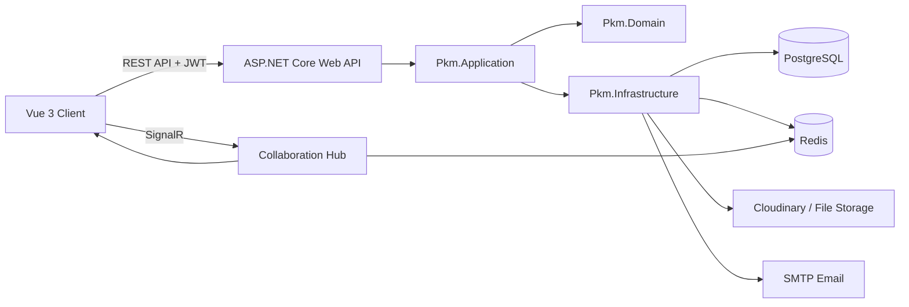

# Block Paged — Hệ thống quản lý tri thức, công việc và cộng tác realtime

> **Block Paged** là một ứng dụng web full-stack lấy cảm hứng từ Notion, kết hợp quản lý tri thức cá nhân, workspace cộng tác, task management, mạng xã hội nội bộ, nhắn tin realtime và bộ gợi ý công việc thông minh **AI Prioritizer**.

---

## Mục lục

- [Tổng quan](#tổng-quan)
- [Điểm nổi bật](#điểm-nổi-bật)
- [Chức năng chính](#chức-năng-chính)
- [AI Prioritizer](#ai-prioritizer)
- [Công nghệ sử dụng](#công-nghệ-sử-dụng)
- [Kiến trúc hệ thống](#kiến-trúc-hệ-thống)
- [Cấu trúc thư mục](#cấu-trúc-thư-mục)
- [Yêu cầu môi trường](#yêu-cầu-môi-trường)
- [Cấu hình môi trường](#cấu-hình-môi-trường)
- [Hướng dẫn chạy local](#hướng-dẫn-chạy-local)
- [Quy trình migration database](#quy-trình-migration-database)
- [Realtime và Redis](#realtime-và-redis)
- [Checklist trước khi demo](#checklist-trước-khi-demo)
- [Hướng phát triển tiếp theo](#hướng-phát-triển-tiếp-theo)

---

## Tổng quan

**Block Paged** được xây dựng theo định hướng **Block-based Personal Knowledge Management**. Người dùng có thể tạo workspace, tạo page theo dạng block, quản lý task, cộng tác realtime với thành viên, theo dõi hoạt động, nhận thông báo, kết bạn, nhắn tin riêng và chia sẻ workspace.

Dự án không chỉ là một ứng dụng ghi chú đơn thuần, mà là một hệ thống cộng tác gồm nhiều module liên kết với nhau:

- **Workspace** để tổ chức không gian làm việc.
- **Page block-based** để ghi chú, quản lý nội dung và tài liệu.
- **Task management** để theo dõi công việc theo workspace/page.
- **Realtime collaboration** để nhiều người cùng làm việc trên một page.
- **Social hub** để kết bạn, xem hồ sơ cá nhân và workspace public.
- **Messenger** để nhắn tin riêng, gửi ảnh và chia sẻ workspace.
- **AI Prioritizer** để phân tích và gợi ý task nên làm dựa trên độ ưu tiên, hạn chót và độ trùng lặp nội dung.

---

## Điểm nổi bật

### Về sản phẩm

- Giao diện lấy cảm hứng từ **Notion**, tối giản, sạch và tập trung vào nội dung.
- Hỗ trợ quản lý workspace, page, task, member, notification, social và message trong cùng một hệ thống.
- Có cơ chế phân quyền theo vai trò trong workspace: **Owner / Manager / Member / Viewer**.
- Có trang cá nhân, ảnh đại diện, ảnh bìa, bio và danh sách workspace public.
- Cho phép người dùng tham gia workspace public của bạn bè với quyền **Viewer**.
- Hỗ trợ nhắn tin riêng realtime giữa bạn bè, gửi ảnh và chia sẻ workspace qua tin nhắn.
- Có activity log để theo dõi lịch sử thao tác trong workspace.
- Có AI Prioritizer giúp gợi ý task thực tế hơn, tránh spam task trùng nội dung.

### Về kỹ thuật

- Frontend sử dụng **Vue 3 + Vite + TypeScript**.
- Backend sử dụng **ASP.NET Core Web API (.NET 8)**.
- Áp dụng kiến trúc tách lớp theo hướng **Clean Architecture**:
  - `Pkm.Api`
  - `Pkm.Application`
  - `Pkm.Domain`
  - `Pkm.Infrastructure`
- Sử dụng **Entity Framework Core + PostgreSQL** để lưu trữ dữ liệu.
- Sử dụng **JWT** cho xác thực và bảo vệ API.
- Sử dụng **SignalR** cho realtime collaboration, messaging, notification và presence.
- Sử dụng **Redis** cho cache, presence, lock và hỗ trợ realtime ổn định hơn.
- Hỗ trợ upload ảnh thông qua storage service.
- Có Swagger/OpenAPI trong môi trường development.

---

## Chức năng chính

### 1. Xác thực và tài khoản

- Đăng ký tài khoản.
- Đăng nhập bằng username/password.
- Cấp JWT access token.
- Refresh token.
- Đăng xuất một thiết bị hoặc tất cả thiết bị.
- Cập nhật hồ sơ cá nhân.
- Đổi mật khẩu.
- Upload avatar.

---

### 2. Workspace

- Tạo workspace.
- Cập nhật tên, mô tả và quyền riêng tư.
- Xóa workspace.
- Chế độ workspace:
  - **Private**: chỉ thành viên được truy cập.
  - **Public**: người khác có thể xem hoặc tham gia với quyền Viewer.
- Quản lý thành viên.
- Mời thành viên bằng email.
- Thay đổi vai trò thành viên.
- Xóa thành viên khỏi workspace.
- Rời workspace.
- Chuyển quyền sở hữu workspace.
- Tham gia workspace public với quyền Viewer.
- Phân quyền UI: người không có quyền sẽ không thấy các nút thao tác không hợp lệ.

---

### 3. Page và block editor

- Tạo page trong workspace.
- Tạo sub-page.
- Cập nhật title, icon và cover.
- Hiển thị page theo workspace tree.
- Mở rộng/thu gọn page tree.
- Favorite page.
- Recent pages.
- Duplicate page.
- Xóa tạm page vào Trash.
- Restore page từ Trash.
- Tìm kiếm page theo workspace.
- Hiển thị Trash ổn định trong sidebar, tránh nhấp nháy khi đổi workspace.
- Hỗ trợ block editor với nhiều loại block như paragraph, heading, list, quote, code, image...

---

### 4. Realtime collaboration

- User presence theo workspace/page.
- Heartbeat để biết user đang online/offline.
- Hiển thị người đang hoạt động trong workspace.
- Khóa block khi một user đang chỉnh sửa, tránh ghi đè nội dung.
- Tự động gia hạn và nhả lock khi user dừng chỉnh sửa.
- Broadcast realtime khi page/block/task thay đổi.

---

### 5. Task management

- Tạo task gắn với page hoặc workspace.
- Cập nhật task.
- Xóa task.
- Đổi trạng thái task:
  - `todo`
  - `doing`
  - `done`
- Đặt priority:
  - `low`
  - `medium`
  - `high`
- Đặt due date.
- Gán người thực hiện.
- Bỏ gán người thực hiện.
- Lọc task theo status, priority, assignee, due date.
- Xem task được giao cho bản thân.
- Bình luận task.
- Reply comment.
- Sửa/xóa/restore comment.

---

### 6. AI Prioritizer

**AI Prioritizer** là module gợi ý task thông minh trong hệ thống. Thay vì chỉ lấy task cũ rồi đề xuất lại một cách máy móc, module này phân tích task theo nhiều tiêu chí để đưa ra gợi ý có ích hơn.

AI Prioritizer có thể:

- Chấm điểm task dựa trên:
  - độ ưu tiên,
  - deadline,
  - trạng thái task,
  - lịch sử hoàn thành,
  - độ phù hợp với cấu hình người dùng.
- Nhận diện các task có nội dung gần giống nhau.
- Gộp các task trùng ý nghĩa như:
  - `học bài`
  - `học bài 1`
  - `ôn bài`
- Tránh gợi ý nhiều task thực chất là cùng một công việc.
- Hạn chế gợi ý task quá mơ hồ, không có deadline hoặc không đủ độ ưu tiên.
- Cho phép người dùng cấu hình:
  - bật/tắt auto recommendation,
  - khung giờ làm việc,
  - số lượng gợi ý tối đa,
  - mức priority tối thiểu,
  - độ nhạy gợi ý,
  - khoảng thời gian giữa các lần gợi ý tự động.
- Có preset cấu hình nhanh như:
  - Cân bằng,
  - Tập trung,
  - Nghiêm ngặt,
  - Nhiều gợi ý.

Module này không phụ thuộc bắt buộc vào API AI bên ngoài. Hệ thống ưu tiên dùng scoring, rule-based logic và semantic dedupe nội bộ để phù hợp với đồ án và dễ demo ổn định.

---

### 7. Notification

- Lấy danh sách thông báo.
- Đếm số thông báo chưa đọc.
- Đánh dấu một thông báo là đã đọc/chưa đọc.
- Đánh dấu tất cả thông báo là đã đọc.
- Xóa thông báo.
- Nhận notification realtime khi có sự kiện liên quan.

---

### 8. Activity log

- Ghi lại lịch sử thao tác trong workspace.
- Theo dõi các hành động như:
  - tạo/cập nhật/xóa,
  - archive/restore,
  - assign/unassign,
  - complete/reopen,
  - thay đổi quyền,
  - thao tác realtime.
- Lọc activity theo loại entity, action, user và thời gian.
- Giao diện activity log dạng panel toàn màn hình.
- Ẩn các GUID kỹ thuật khỏi UI để người dùng cuối dễ hiểu hơn.

---

### 9. Social hub

- Tìm kiếm user.
- Xem profile cá nhân của user.
- Cập nhật bio và cover cá nhân.
- Gửi lời mời kết bạn.
- Chấp nhận/từ chối lời mời kết bạn.
- Hủy lời mời đã gửi.
- Xóa bạn bè.
- Xem danh sách bạn bè.
- Xem workspace public của bạn bè.
- Click vào workspace public của bạn bè để tham gia với quyền Viewer.

---

### 10. Messenger

- Tạo hoặc mở cuộc trò chuyện riêng.
- Nhắn tin realtime giữa hai user.
- Gửi tin nhắn văn bản.
- Gửi ảnh.
- Gửi workspace share qua tin nhắn.
- Nhận workspace share và tham gia workspace.
- Chặn việc tham gia lại workspace đã tham gia.
- Hiển thị nút “Đã tham gia” khi user đã là member.
- Unread message badge trên top nav và từng conversation.
- Mark as read khi mở conversation.
- Typing indicator realtime.

---

## Công nghệ sử dụng

### Frontend

- Vue 3
- TypeScript
- Vite
- Vue Router
- Pinia
- Axios
- Bootstrap 5
- Bootstrap Icons
- CSS module theo từng component
- SignalR client

### Backend

- .NET 8
- ASP.NET Core Web API
- Entity Framework Core
- PostgreSQL
- JWT Bearer Authentication
- SignalR
- Redis
- Swagger / OpenAPI
- Clean Architecture
- FluentValidation
- Cloudinary/storage service cho upload ảnh
- SMTP/email service cho luồng mời workspace

### Hạ tầng

- PostgreSQL
- Redis
- Docker / Docker Compose
- Swagger UI
- Git/GitHub

---

## Kiến trúc hệ thống



### Luồng tổng quát

1. Client đăng nhập và nhận JWT.
2. Client gọi REST API để thao tác workspace, page, task, social, message...
3. Backend xử lý nghiệp vụ qua application layer.
4. Domain layer giữ entity, enum và rule cốt lõi.
5. Infrastructure layer thao tác database, Redis, SignalR, file storage và email.
6. SignalR gửi realtime event về client khi có thay đổi.

---

## Cấu trúc thư mục

```text
rudeusgs-block-based-pkm/
├── client/
│   ├── src/
│   │   ├── api/                         # API services và response/request models
│   │   ├── components/                  # Component dùng chung theo module
│   │   │   ├── activity/                # Activity log panel
│   │   │   ├── editor/                  # Page editor
│   │   │   ├── layout/                  # Top nav, member sidebar
│   │   │   ├── messaging/               # Messenger panel
│   │   │   ├── page/                    # Create page modal
│   │   │   ├── shared/                  # Toast, confirm modal
│   │   │   ├── sidebar-left/            # Sidebar trái, workspace tree, settings
│   │   │   ├── social/                  # Social hub
│   │   │   ├── task/                    # Task UI
│   │   │   └── workspace/               # Workspace modal/share/settings
│   │   ├── modules/                     # Composables theo feature
│   │   ├── realtime/                    # SignalR client
│   │   ├── router/                      # Vue Router
│   │   ├── utils/                       # Utility chung
│   │   └── views/                       # Layout, login, register, landing, success
│   ├── package.json
│   └── vite.config.ts
│
└── server/
    └── src/
        ├── Pkm.Api/                     # API host, controllers, middleware, contracts
        ├── Pkm.Application/             # Use cases, commands, queries, validators, policies
        ├── Pkm.Domain/                  # Entity, enum, domain rule
        ├── Pkm.Infrastructure/          # EF Core, repository, Redis, SignalR, storage, email
        ├── Pkm.Api.slnx
        └── dotnet-tools.json
```

---

## Yêu cầu môi trường

### Bắt buộc

- Node.js `^20.19.0` hoặc `>=22.12.0`
- npm
- .NET SDK 8
- PostgreSQL
- Git

### Khuyến nghị

- Docker Desktop để chạy Redis nhanh.
- Visual Studio 2022 hoặc VS Code.
- Postman/Insomnia hoặc Swagger UI để test API.
- pgAdmin/DBeaver để kiểm tra database.

---

## Cấu hình môi trường

### Frontend

Tạo file `.env` trong thư mục `client`:

```env
VITE_API_BASE_URL=https://localhost:7286/api/v1/
```

Nếu backend chạy port khác, sửa lại URL này cho khớp.

---

### Backend

Cấu hình trong `server/src/Pkm.Api/appsettings.json` hoặc `appsettings.Development.json`.

Ví dụ:

```json
{
  "ConnectionStrings": {
    "Connection": "Host=localhost;Port=5432;Database=block_paged_db;Username=postgres;Password=your_password"
  },
  "JWT": {
    "Secret": "your-super-secret-key-with-enough-length",
    "ValidIssuer": "BlockPaged",
    "ValidAudience": "BlockPagedUsers"
  },
  "Cors": {
    "AllowedOrigins": [
      "http://localhost:5173",
      "https://localhost:5173"
    ]
  },
  "Redis": {
    "Connection": "localhost:6379"
  }
}
```

Nếu có dùng upload ảnh hoặc email mời workspace, cần cấu hình thêm provider tương ứng trong `appsettings`.

---

## Hướng dẫn chạy local

### 1. Clone source

```bash
git clone https://github.com/RudeusGs/block-based-pkm.git
cd rudeusgs-block-based-pkm
```

---

### 2. Cài frontend

```bash
cd client
npm install
```

Chạy frontend:

```bash
npm run dev
```

Frontend thường chạy tại:

```text
http://localhost:5173
```

---

### 3. Cài backend

Từ root project:

```bash
cd server/src
dotnet restore Pkm.Api.slnx
```

Chạy backend:

```bash
cd Pkm.Api
dotnet run
```

Backend sẽ chạy theo profile trong `launchSettings.json`.

---

### 4. Bật Redis

Nếu project có file Docker Compose cho Redis:

```bash
docker compose -f server/redis/docker-compose.redis.yml up -d
```

Kiểm tra Redis đang chạy:

```bash
docker ps
```

Nếu không dùng Docker Compose, có thể chạy Redis bằng Docker trực tiếp:

```bash
docker run -d --name block-paged-redis -p 6379:6379 redis:latest
```

---

## Quy trình migration database

Từ thư mục `server/src/Pkm.Api`:

```bash
dotnet ef migrations add <TenMigration> --project ../Pkm.Infrastructure --startup-project .
```

Cập nhật database:

```bash
dotnet ef database update --project ../Pkm.Infrastructure --startup-project .
```

Ví dụ:

```bash
dotnet ef migrations add InitDatabase --project ../Pkm.Infrastructure --startup-project .
dotnet ef database update --project ../Pkm.Infrastructure --startup-project .
```

---

## Realtime và Redis

Ứng dụng dùng **SignalR** cho các chức năng realtime. Hub chính được map tại:

```text
/hubs/collaboration
```

Redis được dùng để hỗ trợ:

- cache dữ liệu,
- presence user online/offline,
- block edit lock,
- realtime flow ổn định hơn khi có nhiều user,
- giảm tải database ở một số tác vụ.

Khi demo các tính năng realtime như chat, online user, block lock hoặc typing indicator, nên bật Redis trước để kết quả ổn định nhất.

---

## API và Swagger

Trong môi trường development, Swagger UI được bật để test API.

Sau khi chạy backend, mở URL backend trên trình duyệt. Ví dụ:

```text
https://localhost:7286/swagger
```

Tùy cấu hình Swagger của backend, UI có thể được map ở root hoặc `/swagger`.

---

## Checklist trước khi demo

Trước khi báo cáo/demo, nên kiểm tra nhanh:

```bash
docker ps
```

Sau đó chạy:

```bash
cd server/src/Pkm.Api
dotnet run
```

Mở terminal khác:

```bash
cd client
npm run dev
```

Checklist:

- Redis đã bật.
- PostgreSQL đã bật.
- Backend chạy không lỗi.
- Frontend chạy không lỗi.
- Đăng nhập được.
- Có sẵn ít nhất 2 user để demo realtime.
- Có sẵn workspace, page, task.
- Test nhanh:
  - tạo page,
  - sửa block realtime,
  - tạo task,
  - AI Prioritizer,
  - kết bạn,
  - nhắn tin,
  - chia sẻ workspace,
  - activity log,
  - notification.

---

## Hướng phát triển tiếp theo

Một số hướng có thể phát triển thêm sau đồ án:

- Global search toàn hệ thống.
- Command palette giống Notion.
- Page template.
- Mention user trong page/task/comment.
- Export page ra PDF/Markdown.
- Version history cho page.
- Calendar view cho task.
- Kanban board cho task.
- Mobile responsive hoàn chỉnh hơn.
- Unit test/integration test đầy đủ.
- Docker Compose production cho toàn bộ hệ thống.
- CI/CD tự động build và deploy.

---

## Mục tiêu dự án

Dự án được thực hiện nhằm xây dựng một hệ thống quản lý tri thức và cộng tác realtime có tính thực tế, áp dụng các kiến thức:

- phát triển frontend hiện đại,
- xây dựng REST API,
- thiết kế database quan hệ,
- xác thực và phân quyền,
- realtime web application,
- clean architecture,
- xử lý nghiệp vụ theo module,
- tối ưu trải nghiệm người dùng,
- triển khai và demo sản phẩm hoàn chỉnh.

---

## Tác giả

**Ngô Trần Nguyên Quân**

Dự án phục vụ mục đích học tập, thực hành và báo cáo đồ án.
